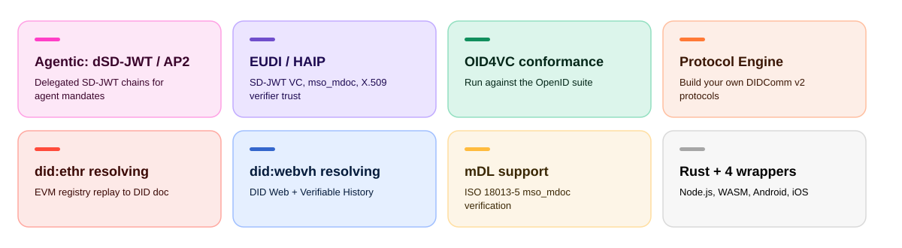
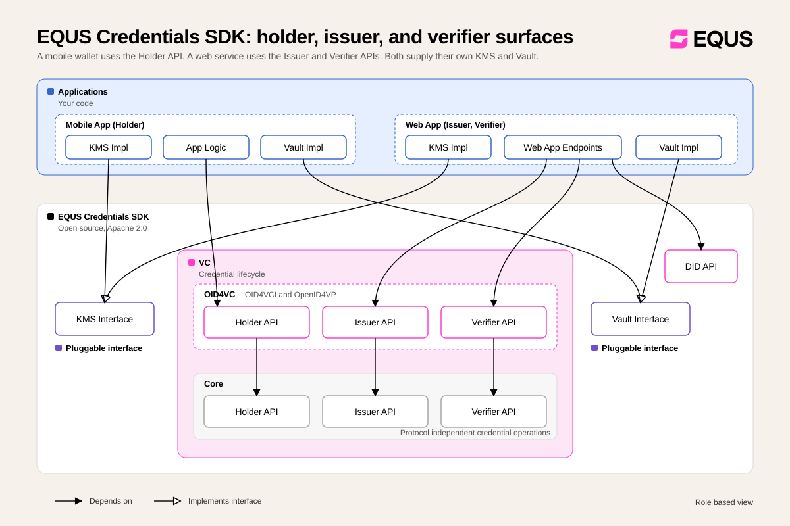

# EQUS SDK

- [About EQUS SDK](#about-equs-sdk)
- [Distinctive Features](#distinctive-features)
- [Supported Protocol Standards](#supported-protocol-standards)
- [How To Build and Run](#how-to-build-and-run)
- [How to Use EQUS SDK in Applications](#how-to-use-equs-sdk-in-applications)
- [Other Docs and Diagrams](#other-docs-and-diagrams)
- [Contributing](#contributing)
- [Dependencies](#dependencies)
- [License](#license)
- [Development Guidelines](docs/guidelines/dev.md)

## About EQUS SDK

EQUS SDK is a library for issuing, holding, and verifying digital credentials. Credentials can be
signed with X.509 certificates or Decentralized Identifiers (DIDs).

The core is written in Rust. Wrappers and builds are available for Node.js (TypeScript), WASM
(TypeScript), Kotlin (Android), and Swift (iOS).

Applications integrating EQUS SDK implement a small number of interfaces (such as KMS and Vault)
or web endpoints (OID4VC). See [How to Use EQUS SDK in Applications](#how-to-use-equs-sdk-in-applications).

See [EQUS SDK stack](docs/equs-sdk-stack.svg).

## Distinctive Features



| Feature | Notes | Code and demos |
| --- | --- | --- |
| Agentic delegation: dSD-JWT / AP2 | Experimental. Delegated SD-JWT chains: a bound hop carries the next party's key, a terminal hop closes the chain. A `delegate` item in OID4VP `transaction_data` turns a normal presentation into a delegation grant. | [Five-party demo](demos/oid4vc/README.md#delegated-sd-jwt-dsd-jwt-demo) · [About dSD-JWT](docs/dsd-jwt.md) · [`dsd_jwt.rs`](src/vc/formats/dsd_jwt.rs) · [`oid4vp/delegate.rs`](src/vc/oid4vp/delegate.rs) · [tests](src/vc/oid4vp/tests.rs) |
| EUDI / HAIP building blocks | The components those profiles build on: `mso_mdoc` and `dc+sd-jwt`, SD-JWT VC with key binding, `x509_san_dns` / `x509_hash` client identifier prefixes, issuer trust anchors. | [OID4VC demo](demos/oid4vc/README.md) · [`mso_mdoc.rs`](src/vc/formats/mso_mdoc.rs) · [`x509_truststore.rs`](src/utils/x509_truststore.rs) |
| OID4VC conformance tests | Exercised against the OpenID Foundation conformance suite, locally under Docker or remotely. | [conformance-tests.md](docs/guidelines/conformance-tests.md) · [holder.md](docs/guidelines/conformance-tests/holder.md) |
| DIDComm v2 and Protocol Engine | A framework for defining your own DIDComm protocols (your messages, the `Protocol` trait, and stateless or state-machine handlers), not only the ones the SDK ships. | [protocol-engine.md](docs/guidelines/protocol-engine.md) · [`src/didcomm`](src/didcomm) · [e2e test](tests/e2e/protocol_engine.rs) |
| `did:ethr` resolving | Replays EtherDIDRegistry event history on any EVM chain over JSON-RPC to rebuild the DID document. Multi-chain, configurable event topics. Non-wasm. | [`src/did/didethr`](src/did/didethr) |
| `did:webvh` resolving | Resolves the DID Web + Verifiable History JSONL log. | [`src/did/webvh`](src/did/webvh) · [Node.js](wrappers/nodejs/src/did/webvh.rs) |
| mDL support | Verification only. ISO/IEC 18013-5 `mso_mdoc` over OID4VP. Trust anchors supplied as root certificates. | [`mso_mdoc.rs`](src/vc/formats/mso_mdoc.rs) · [`presentation_verification_flow_with_mdl`](tests/e2e/vc_oid4vp.rs) |
| Rust core and 4 language wrappers | One Rust implementation, published for Node.js (TypeScript), WASM (TypeScript), Android (Kotlin), and iOS (Swift). Protocol logic is not reimplemented per platform. | [`wrappers/nodejs`](wrappers/nodejs) · [`wrappers/wasm`](wrappers/wasm) · [`wrappers/uniffi`](wrappers/uniffi) · [Android demo](demos/android/README.md) · [iOS demo](demos/ios/OID4VC/README.md) |

## Supported Protocol Standards

See [Components](docs/equs-sdk-component-layers.svg).

### Credential formats

| Format | Signature suites | Specification | Notes |
| --- | --- | --- | --- |
| SD-JWT VC | ECDSA, EdDSA | [draft-ietf-oauth-sd-jwt-vc-08](https://datatracker.ietf.org/doc/draft-ietf-oauth-sd-jwt-vc/) | |
| dSD-JWT | ECDSA, EdDSA | [draft-gco-oauth-delegate-sd-jwt-00](https://datatracker.ietf.org/doc/draft-gco-oauth-delegate-sd-jwt/) | Delegated SD-JWT chains, behind the `delegate-sd-jwt` feature |
| W3C VC JSON-LD v1 | ECDSA, EdDSA | [Verifiable Credentials Data Model v1.1](https://www.w3.org/TR/2022/REC-vc-data-model-20220303/) | |
| W3C VC JSON-LD v2 | ECDSA, EdDSA, BBS+ 2023 | [Verifiable Credentials Data Model v2.0](https://www.w3.org/TR/vc-data-model-2.0/) | |
| mDL (`mso_mdoc`) | | [ISO/IEC 18013-7](https://www.iso.org/standard/82772.html) | Verification only |

### Issuance protocols

| Protocol | Specification | Supported capabilities |
| --- | --- | --- |
| OID4VCI | [version 1.0](https://openid.net/specs/openid-4-verifiable-credential-issuance-1_0.html) | Authorization Code Flow using the `scope` parameter to request issuance; Pre-Authorized Code Flow with optional Transaction Code (`tx_code`); batch issuance; deferred issuance; notification |
| WACI Issue Credential 3.0 | [specification](https://github.com/decentralized-identity/waci-didcomm/blob/main/issue_credential/README.md) | Issuance over DIDComm |

Two points to keep in mind for OID4VCI:

| Topic | Behavior |
| --- | --- |
| Credential selection | The credentials to issue come from the offer's `credential_configuration_ids`. `scope` applies to the Authorization Code Flow only. |
| Access tokens | Token generation is delegated to the application. The SDK is not an Authorization Server. Token validation is optional: configure introspection or JWKS while building the Issuer, or validate on the application side. |

### Presentation protocols

| Protocol | Specification | Supported capabilities |
| --- | --- | --- |
| OID4VP | [version 1.0](https://openid.net/specs/openid-4-verifiable-presentations-1_0.html) | DIF Presentation Exchange and Digital Credentials Query Language (DCQL); cross-device and same-device flows; SIOPv2 extension ([draft 13](https://openid.net/specs/openid-connect-self-issued-v2-1_0.html)); all response modes (`direct_post`, `direct_post.jwt`, `dc_api`, `dc_api.jwt`, `fragment`, `fragment.jwt`); signed Authorization Requests (Request Objects) by value or by reference; Transaction Data; Holder Binding |
| WACI Present Proof 3.0 | [specification](https://github.com/decentralized-identity/waci-didcomm/blob/main/present_proof/present-proof-v3.md) | Presentation over DIDComm |

OID4VP client identifier prefixes:

| Role | Supported prefixes |
| --- | --- |
| Verifier | `decentralized_identifier`, `origin`, `redirect_uri`, `x509_san_dns`, `x509_hash` |
| Holder | `decentralized_identifier`, `redirect_uri` |

`x509_san_dns` and `x509_hash` are used by the Verifier to generate signed Authorization Requests.
The Holder does not consume such requests.

### Revocation

| Mechanism | Specification | Formats |
| --- | --- | --- |
| Token Status List for SD-JWT VC | [draft-ietf-oauth-status-list-07](https://datatracker.ietf.org/doc/draft-ietf-oauth-status-list/07/) | JWT |

### DID methods

Listed in the [W3C DID method registry](https://www.w3.org/TR/did-extensions-methods/).

| Method | Specification |
| --- | --- |
| `did:key` | [specification](https://w3c-ccg.github.io/did-key-spec/) |
| `did:web` | [specification](https://w3c-ccg.github.io/did-method-web/) |
| `did:peer` | [specification](https://identity.foundation/peer-did-method-spec/index.html) |
| `did:ethr` | [specification](https://github.com/decentralized-identity/ethr-did-resolver/blob/master/doc/did-method-spec.md) |
| `did:webvh` | [specification](https://identity.foundation/didwebvh/v1.0/) |

### Messaging

| Protocol | Specification | Notes |
| --- | --- | --- |
| DIDComm v2 | [specification](https://identity.foundation/didcomm-messaging/spec/) | Protocol Engine for defining custom protocols over DIDComm v2 |

## How To Build and Run

Prerequisites: `rustc` >= 1.97 (see `rust-version` in [`Cargo.toml`](Cargo.toml)).

```shell
cargo build --all-features
cargo test --all-features
```

### Cargo features

| Feature | Enables |
| --- | --- |
| `in-memory` | Reference `Kms`, `Vault`, `Storage`, and `NonceHandler` implementations in [`src/inmem`](src/inmem) |
| `didcomm-http-transport` | HTTP transport for DIDComm ([`src/didcomm/transport/http`](src/didcomm/transport/http)) |
| `delegate-sd-jwt` | Delegated SD-JWT (dSD-JWT) credential chains |
| `test-utils` | Test helpers that are otherwise only available under `cfg(test)` |

### Generate documentation

```shell
cargo doc --no-deps
```

### Collecting logs

EQUS SDK logs through the [`tracing`](https://docs.rs/tracing) crate. To collect logs on the
application side, see [Consuming logs](docs/guidelines/logging.md#consuming-logs).

### Demos

The full list is in [demos/README.md](demos/README.md).

| Demo | Platform |
| --- | --- |
| [OID4VC web services](demos/oid4vc/README.md) | Pure Rust |
| [OID4VC end-to-end flows](demos/nodejs/oid4vc/README.md) | Node.js |
| [OID4VC wallet interaction flow](demos/wasm/oid4vc/README.md) | Frontend, WASM |
| [Multi-thread support](demos/multi-thread/README.md) | Rust |
| [Android demo](demos/android/README.md) | Kotlin |
| [iOS demo](demos/ios/OID4VC/README.md) | Swift |

### E2E tests

Located in [`tests/e2e`](tests/e2e).

| Test | Covers |
| --- | --- |
| [VC Core](tests/e2e/vc_core.rs) | SD-JWT, BBS+, status list |
| [OID4VCI](tests/e2e/vc_oid4vci.rs) | Issuance flows |
| [OID4VP](tests/e2e/vc_oid4vp.rs) | Presentation flows, including mDL verification |
| [DIDComm Protocol Engine](tests/e2e/protocol_engine.rs) | Custom protocol (Tic Tac Toe game) |
| [WACI/Aries V3](tests/e2e/waci_aries.rs) | Issuance and presentation over DIDComm |
| [Custom DID resolvers](tests/e2e/custom_did_resolvers.rs) | Resolver extension points |

## How to Use EQUS SDK in Applications


### What you have to implement

EQUS SDK delegates key material, credential storage, and nonce handling to the integrating
application. Depending on the role you build, implement:

| Trait | Responsibility |
| --- | --- |
| [`Kms`](src/kms.rs) | Key generation, signing, and verification. Keys never leave your implementation. |
| [`Vault`](src/vault.rs) | Storing and finding Verifiable Credentials (Holder). |
| [`Storage`](src/storage.rs) | Generic key-value persistence used by the protocol services. |
| [`NonceHandler`](src/nonce.rs) | Issuing nonces. Unpredictability, expiry, and single use are yours to enforce. |

Outbound HTTP goes through [`HttpClient`](src/http.rs). You do not have to implement it, since
[`ReqwestClient`](src/reqwest/mod.rs) is built in, but you may, to reuse your own HTTP stack.

[`src/inmem`](src/inmem) ships reference `Kms`, `Vault`, `Storage`, and `NonceHandler`
implementations behind the `in-memory` feature. They are the fastest path from clone to a running
flow. They hold everything in process memory, so keys and credentials do not survive a restart. Use
them for tests and demos, not as a storage layer.

### Plugins

[`plugins`](./plugins) holds optional crates that implement the traits above against a concrete
backend, so you can depend on a ready-made implementation instead of writing your own. Each plugin
is its own crate with its own dependencies. Add the ones you need rather than enabling a feature on
the SDK.

| Plugin | Implements | Backend |
| --- | --- | --- |
| [`plugins/askar`](./plugins/askar) | [`Kms`](src/kms.rs), [`Vault`](src/vault.rs) | Hyperledger Askar, an encrypted store over SQLite or PostgreSQL |

### OID4VC

[Integration example](demos/oid4vc/README.md)



The role-based view above shows which SDK surfaces each type of application uses. The flow
diagrams referenced in the tables below are:

| Flow | Diagram |
| --- | --- |
| Auth Code: Full Flow | [vc-oid4vc-api-auth-code-full.png](docs/vc-oid4vc-api-auth-code-full.png) |
| Auth Code: Already Authorized | [vc-oid4vc-api-auth-code-already-authorized.png](docs/vc-oid4vc-api-auth-code-already-authorized.png) |
| Pre-Authorized Code Flow | [vc-oid4vc-api-pre-auth-code-full.png](docs/vc-oid4vc-api-pre-auth-code-full.png) |

#### Holder (Wallet)

| Step | What to do |
| --- | --- |
| 1 | Implement an application or platform specific `Kms`. |
| 2 | Implement an application or platform specific `Vault` to store and find Verifiable Credentials. |
| 3 | Integrate the OID4VC Holder API, following the Auth Code or Pre-Authorized Code flow diagrams above. |

Holder API bindings per platform:

| Platform | Bindings | Build instructions |
| --- | --- | --- |
| WASM | [`index.d.ts`](wrappers/wasm/pkg/index.d.ts) | [build](wrappers/wasm/README.md) |
| Kotlin | [`equssdk.kt`](wrappers/uniffi/kotlin/src/main/kotlin/com/equs/sdk/equssdk.kt) | [build](wrappers/uniffi/README.md#building) |
| Swift | [`equssdk.swift`](wrappers/uniffi/swift/Sources/EqusSdk/equssdk.swift) | [build](wrappers/uniffi/README.md#3-generate-the-xcframework-and-swift-bindings) |

#### Issuer

| Step | What to do |
| --- | --- |
| 1 | Implement an application or platform specific `Kms`. |
| 2 | Instantiate the OID4VC Issuer Service (see API references below). |
| 3 | Optional: use delegated issuance. `prepare_credential` validates the request and builds an `UnsignedCredential` ready for inspection; `sign_credential` consumes it and returns the finished `Credential`. Use this when you need to inspect or transform the credential before signing, or when signing is delegated to a remote service. |
| 4 | Create Issuer Metadata. |
| 5 | Create a Credential Offer. Optional for the Authorization Code Flow, required for the Pre-Authorized Code Flow. |
| 6 | Implement the issuer endpoints (table below). Each endpoint calls the corresponding EQUS SDK Issuer API method. |
| 7 | Integrate an Authorization Server (table below). |

Issuer API references:

| Language | Component | Location |
| --- | --- | --- |
| Rust | Issuer API | [`src/vc/oid4vci/api.rs`](src/vc/oid4vci/api.rs) |
| Rust | Issuer Builder | [`src/vc/oid4vci/builder.rs`](src/vc/oid4vci/builder.rs) |
| Rust | Issuer Service (not publicly exposed) | [`src/vc/oid4vci/issuer.rs`](src/vc/oid4vci/issuer.rs) |
| Rust | `PrepareCredential` / `SignCredential` traits (delegated issuance) | [Core API](src/vc/core/api.rs) |
| Rust | Stand-alone signer, no issuer metadata (delegated issuance) | [`CredentialSigner`](src/vc/core/signer.rs) |
| Node.js | Issuer API | [`binary.d.ts`](wrappers/nodejs/binary.d.ts) (available after [build](wrappers/nodejs/package.json)) |
| Node.js | Issuer Builder | [`issuer.ts`](wrappers/nodejs/types/vc/oid4vci/issuer.ts) |
| All wrappers | Delegated issuance | Available via the VC Core modules |

Issuer endpoints:

| Endpoint | SDK method | Notes |
| --- | --- | --- |
| `GET /.well-known/openid-credential-issuer` | `get_issuer_metadata` | Must be a prefix to any path component your implementation serves the API at (see [Section 3.1 of RFC 8414](https://datatracker.ietf.org/doc/html/rfc8414#section-3.1)). |
| `POST /credential` | `issue_credential` | |

Authorization Server options:

| Flow | Option | Details |
| --- | --- | --- |
| Authorization Code | Existing OAuth server, for example Keycloak | Either issue a new access token with the required scope (Auth Code: Full Flow), or reuse an existing access token and make sure the CredDefID is included as one of the scope values (Auth Code: Already Authorized). |
| Pre-Authorized Code | Existing OAuth server | Must support the grant type `urn:ietf:params:oauth:grant-type:pre-authorized_code`. |
| Pre-Authorized Code | Custom authorization server | Provide a Token Endpoint that validates the pre-authorized code and optional transaction code and issues an access token (see [section 6.1 of OID4VCI](https://openid.net/specs/openid-4-verifiable-credential-issuance-1_0.html#section-6.1)), and a Token Introspection Endpoint that lets the Issuer check token status before processing credential requests. |

#### Web App: VC Status List Issuer

| Step | What to do |
| --- | --- |
| 1 | Implement an application or platform specific `Kms`. |
| 2 | Instantiate the Status Issuer Service: [Status Issuer API](src/vc/core/api.rs), [Status Issuer Service](src/vc/core/status_issuer.rs). |
| 3 | Create a status list and make it publicly available on the web. |

#### Web App: Verifier

| Step | What to do |
| --- | --- |
| 1 | Integrate the OID4VC Verifier Service, following the [Auth Code flow diagram](docs/vc-oid4vc-api-auth-code-full.png). |
| 2 | Implement the verifier endpoint (table below). Each endpoint calls the corresponding EQUS SDK Verifier API method. |

Verifier API references:

| Language | Component | Location |
| --- | --- | --- |
| Rust | Verifier API | [`src/vc/oid4vp/api.rs`](src/vc/oid4vp/api.rs) |
| Rust | Verifier Builder | [`src/vc/oid4vp/builder.rs`](src/vc/oid4vp/builder.rs) |
| Rust | Verifier Service (not publicly exposed) | [`src/vc/oid4vp/verifier.rs`](src/vc/oid4vp/verifier.rs) |
| Node.js | Verifier API | [`verifier.ts`](wrappers/nodejs/types/vc/oid4vp/verifier.ts) |
| Node.js | Verifier Builder | [`verifier-builder.ts`](wrappers/nodejs/types/vc/oid4vp/verifier-builder.ts) |

Verifier endpoints:

| Endpoint | SDK method |
| --- | --- |
| `POST /<authorization-response-uri>` | `verify_presentation` |

Ready-made `Kms` and `Vault` implementations are available. See [Plugins](#plugins).

## Other Docs and Diagrams

| Document | Description |
| --- | --- |
| [API Tiers](docs/api-tiers.png) | Public, pluggable, and internal API surfaces |
| [Component layers](docs/equs-sdk-component-layers.svg) | SDK component overview |
| [Role surfaces](docs/equs-sdk-role-surfaces.svg) | Holder, issuer, and verifier surfaces |
| [VC OID4VC API Auth Code: Full Flow](docs/vc-oid4vc-api-auth-code-full.png) | Sequence diagram |
| [VC OID4VC API Auth Code: Already Authorized](docs/vc-oid4vc-api-auth-code-already-authorized.png) | Sequence diagram |
| [VC Core API](docs/vc-core-api.png) | Protocol independent credential operations |
| [VC Aries over DIDComm](docs/vc-aries-over-didcomm.png) | WACI/Aries exchange over DIDComm |
| [About dSD-JWT](docs/dsd-jwt.md) | Delegated SD-JWT design |
| [Protocol Engine guide](docs/guidelines/protocol-engine.md) | How to implement a DIDComm protocol on the Protocol Engine |
| [DIDComm Protocol Engine Architecture](docs/didcomm-protocol-components.md) | Component breakdown |

## Contributing

Issues and pull requests are welcome. Open an issue before writing anything non-trivial, and report
security problems privately rather than in a public issue.

| Area | Expectation |
| --- | --- |
| Pull request scope | One logical change per pull request. State what changed, why, and how you verified it. Call out breaking changes to the public API or to a wrapper's surface. |
| Tests | Unit tests beside the code, e2e tests in [`tests/e2e`](tests/e2e). See [tests design](docs/guidelines/tests-design.md). |
| Guidelines | Follow the [development guidelines](docs/guidelines/dev.md), in particular [error handling](docs/guidelines/error_handling.md) and [logging](docs/guidelines/logging.md). Never log key material, credential contents, or PII. |
| Wrappers | A new public API usually needs matching surface in the [Node.js](wrappers/nodejs), [WASM](wrappers/wasm), and [UniFFI](wrappers/uniffi) wrappers, or a note saying why it is native-only. |
| AI-assisted contributions | Fine under [`docs/AI_CONSTITUTION.md`](docs/AI_CONSTITUTION.md). You are still responsible for reviewing and explaining every line you submit. |
| Releases | Cut by maintainers ([release guide](docs/guidelines/release.md)). Do not bump versions in a pull request. |
| Licensing | Contributions are accepted under the [Apache License 2.0](./LICENSE). Update [`THIRD-PARTY-NOTICE`](THIRD-PARTY-NOTICE) if a new dependency needs attribution. |

## Dependencies

Every dependency and its pinned version is declared in [`Cargo.toml`](Cargo.toml). Several
dependencies are **maintained forks** pinned to a revision, rather than the public upstreams of the
same name. Build against the sources `Cargo.toml` declares, not against upstream.

## License

EQUS SDK is licensed under the [Apache License 2.0](./LICENSE).

License attribution required by third-party dependencies is reproduced in
[`THIRD-PARTY-NOTICE`](THIRD-PARTY-NOTICE).
