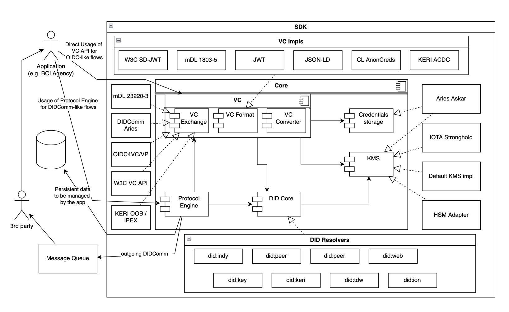
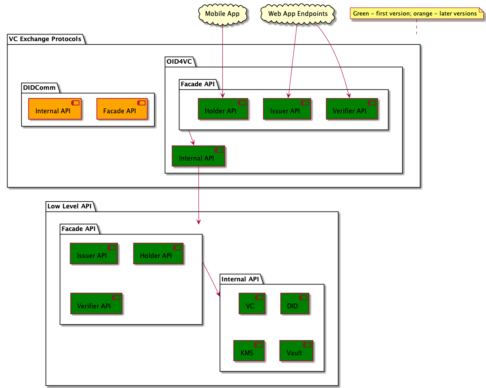
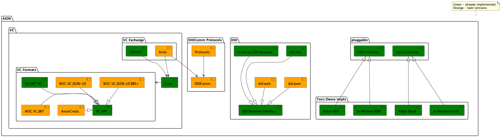
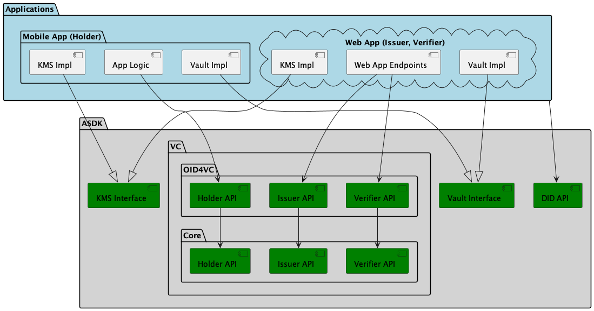

# Agent SDK (ASDK)

- [About ASDK](#about-asdk)
- [API and Components](#api-and-components)
- [Supported SSI Standards](#supported-ssi-standards)
- [How To Build and Run](#how-to-build-and-run)
- [How to Use ASDK in Applications](#how-to-use-asdk-in-applications)
- [Dependencies](#dependencies)
- [Development Guidelines](docs/guidlines/dev.md)

## About ASDK

- ASDK is an SDK (library) providing building blocks for Self-Sovereign Identity (SSI) use cases.
- ASDK is written in Rust; supported wrappers/builds are available for:
    - Node.js (TypeScript)
    - WASM (TypeScript)
    - Kotlin
    - Swift
- ASDK is not an end-user application, but just an ASDK. Applications integrating ASDK will need to implement some
  interfaces (such as KMS and Vault) or Web endpoints (OID4VC). See [How To Use ASDK](#how-to-use-asdk-in-applications)
  below.
- ASDK supports multiple SSI protocols and specifications (see below).



Other diagrams:

- [API Tiers](docs/api-tiers.png)
- [Components](docs/asdk-components.png)
- [VC OID4VC API Auth Code: Full Flow](docs/vc-oid4vc-api-auth-code-full.png)
- [VC OID4VC API Auth Code: Already Authorized](docs/vc-oid4vc-api-auth-code-already-authorized.png)
- [VC Core API](docs/vc-core-api.png)

## API and Components




## Supported SSI Standards

See [Components](docs/asdk-components.png).

#### Implemented

- VC Formats:
    - SD-JWT VC (ECDSA,
      EdDSA) - [draft-ietf-oauth-sd-jwt-vc-08](https://datatracker.ietf.org/doc/draft-ietf-oauth-sd-jwt-vc/)
    - W3C VC JSON-LD V1 (ECDSA,
      EdDSA) - [Verifiable Credentials Data Model v1.1](https://www.w3.org/TR/2022/REC-vc-data-model-20220303/)
    - W3C VC JSON-LD V2 (ECDSA, EdDSA, BBS+
        2023)
            - [Verifiable Credentials Data Model v2.0](https://www.w3.org/TR/vc-data-model-2.0/)
- VC Exchange Protocols: Issuance
    - OID4VCI [draft 15](https://openid.net/specs/openid-4-verifiable-credential-issuance-1_0-15.html)
        - Authorization Code Flow using scope Parameter to Request Issuance of a Credential
        - Preauthorized Code Flow using scope Parameter to Request Issuance of a Credential
        - Batch issuance
            - **NOTE**: The generation and validation of the access token is delegated to the application side.
    - WACI Issue Credential Protocol
      3.0 [specification](https://github.com/decentralized-identity/waci-didcomm/blob/main/issue_credential/README.md)
- VC Exchange Protocols: Presentation
    - OID4VP [draft 24](https://openid.net/specs/openid-4-verifiable-presentations-1_0-24.html)
        - DIF.PresentationExchange query language to request the presentations
        - Cross Device Flow
        - Same Device Flow
        - SIOPv2 extension [draft 13](https://openid.net/specs/openid-connect-self-issued-v2-1_0.html)
        - Digital Credentials Query Language (DCQL)
- VC Revocation:
    - Token Status List for SD-JWT
      VC [draft-ietf-oauth-status-list-07](https://datatracker.ietf.org/doc/draft-ietf-oauth-status-list/07/)
        - Supported Format
            - JWT
- DID methods [list](https://www.w3.org/TR/did-extensions-methods/)
    - did:key [specification](https://w3c-ccg.github.io/did-key-spec/)
    - did:web [specification](https://w3c-ccg.github.io/did-method-web/)
    - did:peer [specification](https://identity.foundation/peer-did-method-spec/index.html)
- DIDComm V2 [specification](https://identity.foundation/didcomm-messaging/spec/)
    - Protocols Engine over DIDComm V2

#### Planned

- VC Formats:
    - mDL
    - W3C JWT
    - AnonCreds
- VC Exchange Protocols:
    - OID4VCI
        - Authorization Code Flow Using Authorization Details Parameter
        - Deferred Issuance
    - OID4VP
        - Response Mode "direct_post.jwt"
    - WACI Present Proof Protocol 3.0
    - Aries AIPv2
- DID methods
    - did:ethr
    - did:webvh
- VC Revocation
    - Bitstring Status List for W3C VC

## How To Build and Run

Pre-requisites:

- rustc version >=1.87

```
cargo build --all-features
cargo test --all-features
```

### Collecting logs on the application side

On the application side, to collect logs from `agent-sdk`, follow the steps below:

1. Add `tracing-subscriber` dependency into `Cargo.toml`:

  ```toml
    tracing-subscriber = "0.3.18"
  ```

2. Add the following to your executable to initialize the default subscriber:

```rust
use tracing_subscriber;

async fn main() {
    tracing_subscriber::fmt::init();
}
```

3. For example, to see `TRACE` level logs, run:

```shell
RUST_LOG=TRACE cargo run
```

### Generate documentation

```
cargo doc --no-deps
```

### [Demos](demos/README.md)

- [OID4VC web services on pure Rust](demos/oid4vc/README.md)
- [OID4VC end-to-end flows on Node.js](demos/nodejs/oid4vc/README.md)
- [OID4VC wallet interaction flow on frontend using WASM](demos/wasm/oid4vc/README.md)
- [Multi-thread support](demos/multi-thread/README.md)
- [Android demo](demos/android/README.md)
- [IOS demo](demos/ios/OID4VC/README.md)

## How to Use ASDK in Applications

### OID4VC

[An example of integration:](demos/oid4vc/README.md)



**Holder (Wallet)**

1. Implement application/platform specific KMS
2. Implement application/platform specific Vault (to store and find Verifiable Credentials)
3. Integrate OID4VC Holder API
    - [VC OID4VC API Auth Code: Full Flow](docs/vc-oid4vc-api-auth-code-full.png)
      or [VC OID4VC API Auth Code: Already Authorized](docs/vc-oid4vc-api-auth-code-already-authorized.png)
    - [VC OID4VC API Pre-Authorized Code Flow](docs/vc-oid4vc-api-pre-auth-code-full.png)
    - WASM wrappers of ASDK can be found [here](wrappers/wasm/pkg/index.d.ts) (available
      after [build](wrappers/wasm/README.md))
    - Kotlin wrappers of ASDK can be found [here](wrappers/uniffi/kotlin/src/main/kotlin/com/bci/asdk/asdk.kt) (
      available after [build](wrappers/uniffi/README.md#building))
    - Swift wrappers of ASDK can be found [here](wrappers/uniffi/swift/Sources/asdk/asdk.swift) (available
      after [build](wrappers/uniffi/README.md#3-generate-the-xcframework-and-swift-bindings))

**Issuer**

1. Implement application/platform specific KMS
2. Instantiate OID4VC Issuer Service
    - [VC OID4VC API Auth Code: Full Flow](docs/vc-oid4vc-api-auth-code-full.png)
      or  [VC OID4VC API Auth Code: Already Authorized](docs/vc-oid4vc-api-auth-code-already-authorized.png)
    - [VC OID4VC API Pre-Authorized Code Flow](docs/vc-oid4vc-api-pre-auth-code-full.png)
    - Rust
        - [Issuer API](src/vc/oid4vci/api.rs)
        - [Issuer Builder](src/vc/oid4vci/builder.rs)
        - [Issuer Service](src/vc/oid4vci/issuer.rs) (not publicly exposed)
    - Node.js
        - [Issuer API](wrappers/nodejs/binary.d.ts) (available after [build](wrappers/nodejs/package.json))
        - [Issuer Builder](wrappers/nodejs/types/vc/oid4vci/issuer.ts)
3. Create Issuer Metadata
4. Create Credential Offer (optional for auth code flow but required for pre-authorized code flow)
5. Implement the following endpoints. Each endpoint should call the corresponding ASDK Issuer API method.
    - GET /.well-known/openid-credential-issuer HTTP/1.1: `get_issuer_metadata`
    - POST /credential HTTP/1.1: `issue_credential`
6. Integrate Authorization Server
    - Authorization Code Flow - Keycloak can be used as Authorization Server
        - Either issue a new access token with the required scope (
          see [VC OID4VC API Auth Code: Full Flow](docs/vc-oid4vc-api-auth-code-full.png)),
        - or re-use existing access token, but make sure that CredDefID is included as one of the scope values (
          see [VC OID4VC API Auth Code: Already Authorized](docs/vc-oid4vc-api-auth-code-already-authorized.png))
    - Pre-Authorized Code Flow - There are two main options:
        - Use an existing OAuth server that supports the grant type
          `urn:ietf:params:oauth:grant-type:pre-authorized_cod`.
        - Implement a custom authorization server with following endpoints:
            - `Token Endpoint` that validates the pre-authorized code and optional transaction code and issues an access
              token.
              For more details,
              see [section 6.1 of the OID4VCI specification](https://openid.net/specs/openid-4-verifiable-credential-issuance-1_0.html#section-6.1).
            - `Token Introspection Endpoint` that allows the Issuer to check token status before processing credential
              requests.

**Web App: VC Status List Issuer**

1. Implement application/platform specific KMS
2. Instantiate Status Issuer Service
    - [Status Issuer API](src/vc/core/api.rs)
    - [Status Issuer Service](src/vc/core/status_issuer.rs)
3. Create a status list and make it publicly available on the web

**Web App: Verifier**

1. Integrate OID4VC Verifier Service
    - [VC OID4VC API Auth Code](docs/vc-oid4vc-api-auth-code-full.png)
    - Rust
        - [Verifier API](src/vc/oid4vp/api.rs)
        - [Verifier Builder](src/vc/oid4vp/builder.rs)
        - [Verifier Service](src/vc/oid4vp/verifier.rs) (not publicly exposed)
    - Node.js
        - [Verifier API](wrappers/nodejs/types/vc/oid4vp/verifier.ts)
        - [Verifier Builder](wrappers/nodejs/types/vc/oid4vp/verifier-builder.ts)
2. Implement the following endpoints. Each endpoint should call the corresponding ASDK Verifier API method.
    - POST /<authorization-response-uri> HTTP/1.1: `verify_presentation`

**Note:**
ASDK contains an example of KMS and Vault (not part of default build) based
on [aries-askar](https://github.com/hyperledger/aries-askar), see [src/askar](plugins/askar). The current
implementations are not recommended for production (just demo purposes), but production ones can be created based on it.

## Dependencies

- https://github.com/spruceid/ssi (v0.10.1)
- https://github.com/openwallet-foundation-labs/sd-jwt-rust
- https://github.com/hyperledger/aries-askar (Test/Demo purposes, not part of default build)


