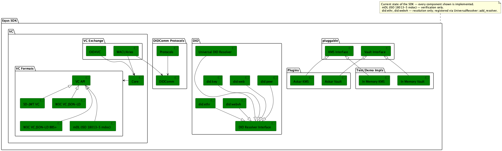
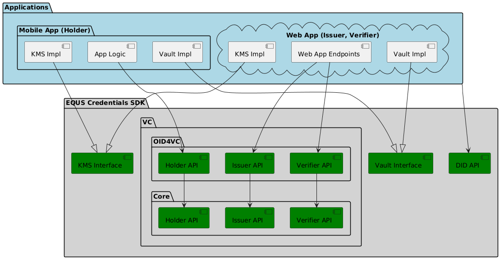

# Equs SDK

- [About Equs SDK](#about-equs-sdk)
- [API and Components](#api-and-components)
- [Supported Protocol Standards](#supported-protocol-standards)
- [How To Build and Run](#how-to-build-and-run)
- [How to Use Equs SDK in Applications](#how-to-use-equs-sdk-in-applications)
- [Dependencies](#dependencies)
- [License](#license)
- [Development Guidelines](docs/guidelines/dev.md)

## About Equs SDK

- Equs SDK is an SDK (library) providing building blocks for identity protocol use cases.
- Equs SDK is written in Rust; supported wrappers/builds are available for:
    - Node.js (TypeScript)
    - WASM (TypeScript)
    - Kotlin
    - Swift
- Equs SDK is not an end-user application, but just an SDK. Applications integrating Equs SDK will need to implement some
  interfaces (such as KMS and Vault) or Web endpoints (OID4VC). See [How To Use Equs SDK](#how-to-use-equs-sdk-in-applications)
  below.
- Equs SDK supports multiple identity protocols and specifications (see below).


Other diagrams:

- [API Tiers](docs/api-tiers.png)
- [Components](docs/equs-sdk-components.png)
- [VC OID4VC API Auth Code: Full Flow](docs/vc-oid4vc-api-auth-code-full.png)
- [VC OID4VC API Auth Code: Already Authorized](docs/vc-oid4vc-api-auth-code-already-authorized.png)
- [VC Core API](docs/vc-core-api.png)
- [VC Aries Over DIDComm](docs/vc-aries-over-didcomm.png)

## API and Components




## Supported Protocol Standards

See [Components](docs/equs-sdk-components.png).

- VC Formats:
    - SD-JWT VC (ECDSA,
      EdDSA) - [draft-ietf-oauth-sd-jwt-vc-08](https://datatracker.ietf.org/doc/draft-ietf-oauth-sd-jwt-vc/)
    - W3C VC JSON-LD V1 (ECDSA,
      EdDSA) - [Verifiable Credentials Data Model v1.1](https://www.w3.org/TR/2022/REC-vc-data-model-20220303/)
    - W3C VC JSON-LD V2 (ECDSA, EdDSA, BBS+ 2023)
        - [Verifiable Credentials Data Model v2.0](https://www.w3.org/TR/vc-data-model-2.0/)
    - mDL [ISO-18013 7](https://www.iso.org/standard/82772.html)
      - Verification only
- VC Exchange Protocols: Issuance
    - OID4VCI [version 1.0](https://openid.net/specs/openid-4-verifiable-credential-issuance-1_0.html)
        - Authorization Code Flow using scope Parameter to Request Issuance of a Credential
        - Preauthorized Code Flow using scope Parameter to Request Issuance of a Credential
        - Batch issuance
            - **NOTE**: Access token generation is delegated to the application — the SDK is not an Authorization Server. Token validation is optional: configure introspection or JWKS while building Issuer, or validate on the application side.
        - Deferred Issuance
        - Notification
    - WACI Issue Credential Protocol
      3.0 [specification](https://github.com/decentralized-identity/waci-didcomm/blob/main/issue_credential/README.md)
- VC Exchange Protocols: Presentation
    - OID4VP [version 1.0](https://openid.net/specs/openid-4-verifiable-presentations-1_0.html)
        - DIF.PresentationExchange query language to request the presentations
        - Cross Device Flow
        - Same Device Flow
        - SIOPv2 extension [draft 13](https://openid.net/specs/openid-connect-self-issued-v2-1_0.html)
        - Digital Credentials Query Language (DCQL)
        - OID4VP
            - All Response Modes defined by the specification
            - Client Identifier Prefixes:
                - Supported by Verifier: "decentralized_identifier", "origin", "redirect_uri", "x509_san_dns" and "x509_hash"
                - Supported by Holder: "decentralized_identifier", "redirect_uri"
                - **NOTE**: "x509_san_dns" and "x509_hash" are used by the Verifier for generating
                  signed Authorization Requests. The Holder does not consume such requests.
            - Transaction Data
            - Holder Binding
    - WACI Present Proof Protocol
      3.0 [specification](https://github.com/decentralized-identity/waci-didcomm/blob/main/present_proof/present-proof-v3.md)
- VC Revocation:
    - Token Status List for SD-JWT
      VC [draft-ietf-oauth-status-list-07](https://datatracker.ietf.org/doc/draft-ietf-oauth-status-list/07/)
        - Supported Format
            - JWT
- DID methods [list](https://www.w3.org/TR/did-extensions-methods/)
    - did:key [specification](https://w3c-ccg.github.io/did-key-spec/)
    - did:web [specification](https://w3c-ccg.github.io/did-method-web/)
    - did:peer [specification](https://identity.foundation/peer-did-method-spec/index.html)
    - did:ethr [specification](https://github.com/decentralized-identity/ethr-did-resolver/blob/master/doc/did-method-spec.md)
    - did:webvh [specification](https://identity.foundation/didwebvh/v1.0/)
- DIDComm V2 [specification](https://identity.foundation/didcomm-messaging/spec/)
    - Protocols Engine over DIDComm V2

## How To Build and Run

Pre-requisites:

- `rustc` >= 1.97 (see `rust-version` in [`Cargo.toml`](Cargo.toml))

```shell
cargo build --all-features
cargo test --all-features
```

### Cargo features

| Feature | Enables |
| --- | --- |
| `in-memory` | Reference `Kms`, `Vault`, `Storage` and `NonceHandler` implementations in [`src/inmem`](src/inmem) |
| `didcomm-http-transport` | HTTP transport for DIDComm ([`src/didcomm/transport/http`](src/didcomm/transport/http)) |
| `delegate-sd-jwt` | Delegated SD-JWT (dSD-JWT) credential chains |
| `test-utils` | Test helpers that are otherwise only available under `cfg(test)` |

### Generate documentation

```shell
cargo doc --no-deps
```

### Collecting logs

Equs SDK logs through the [`tracing`](https://docs.rs/tracing) crate. To collect the logs on the
application side, see [Consuming logs](docs/guidelines/logging.md#consuming-logs).

### [Demos](demos/README.md)

- [OID4VC web services on pure Rust](demos/oid4vc/README.md)
- [OID4VC end-to-end flows on Node.js](demos/nodejs/oid4vc/README.md)
- [OID4VC wallet interaction flow on frontend using WASM](demos/wasm/oid4vc/README.md)
- [Multi-thread support](demos/multi-thread/README.md)
- [Android demo](demos/android/README.md)
- [iOS demo](demos/ios/OID4VC/README.md)

### [E2E tests](tests/e2e)

- [VC Core](tests/e2e/vc_core.rs) — SD-JWT, BBS+, status list
- [OID4VCI](tests/e2e/vc_oid4vci.rs)
- [OID4VP](tests/e2e/vc_oid4vp.rs)
- [DIDComm Protocol Engine](tests/e2e/protocol_engine.rs) (Tic Tac Toe game)
- [WACI/Aries V3](tests/e2e/waci_aries.rs)
- [Custom DID resolvers](tests/e2e/custom_did_resolvers.rs)

## How to Use Equs SDK in Applications

### What you have to implement

Equs SDK delegates key material, credential storage and nonce handling to the integrating
application. Depending on the role you build, implement:

| Trait | Responsibility |
| --- | --- |
| [`Kms`](src/kms.rs) | Key generation, signing and verification. Keys never leave your implementation |
| [`Vault`](src/vault.rs) | Storing and finding Verifiable Credentials (Holder) |
| [`Storage`](src/storage.rs) | Generic key-value persistence used by the protocol services |
| [`NonceHandler`](src/nonce.rs) | Issuing nonces. Unpredictability, expiry and single use are yours to enforce |

Outbound HTTP goes through [`HttpClient`](src/http.rs). You do not have to implement it —
[`ReqwestClient`](src/reqwest/mod.rs) is built in — but you may, to reuse your own HTTP stack.

[`src/inmem`](src/inmem) ships reference `Kms`, `Vault`, `Storage` and `NonceHandler`
implementations behind the `in-memory` feature. They are the fastest path from clone to a running
flow. They hold everything in process memory, so keys and credentials do not survive a restart —
use them for tests and demos, not as a storage layer.

### Plugins

[`plugins`](./plugins) holds optional crates that implement the traits above against a concrete
backend, so you can depend on a ready-made implementation instead of writing your own. Each
plugin is its own crate with its own dependencies — add the ones you need rather than enabling
a feature on the SDK.

| Plugin                             | Implements | Backend |
|------------------------------------| --- | --- |
| [`plugins/askar`](./plugins/askar) | [`Kms`](src/kms.rs), [`Vault`](src/vault.rs) | Hyperledger Askar — an encrypted store over SQLite or PostgreSQL |

### OID4VC

[An example of integration:](demos/oid4vc/README.md)



**Holder (Wallet)**

1. Implement application/platform specific KMS
2. Implement application/platform specific Vault (to store and find Verifiable Credentials)
3. Integrate OID4VC Holder API
    - [VC OID4VC API Auth Code: Full Flow](docs/vc-oid4vc-api-auth-code-full.png)
      or [VC OID4VC API Auth Code: Already Authorized](docs/vc-oid4vc-api-auth-code-already-authorized.png)
    - [VC OID4VC API Pre-Authorized Code Flow](docs/vc-oid4vc-api-pre-auth-code-full.png)
    - WASM wrappers of Equs SDK can be found [here](wrappers/wasm/pkg/index.d.ts) (available
      after [build](wrappers/wasm/README.md))
    - Kotlin wrappers of Equs SDK can be found [here](wrappers/uniffi/kotlin/src/main/kotlin/com/equs/sdk/equssdk.kt) (
      available after [build](wrappers/uniffi/README.md#building))
    - Swift wrappers of Equs SDK can be found [here](wrappers/uniffi/swift/Sources/EqusSdk/equssdk.swift) (available
      after [build](wrappers/uniffi/README.md#3-generate-the-xcframework-and-swift-bindings))

**Issuer**

1. Implement application/platform specific KMS
2. Instantiate OID4VC Issuer Service
    - [VC OID4VC API Auth Code: Full Flow](docs/vc-oid4vc-api-auth-code-full.png)
      or  [VC OID4VC API Auth Code: Already Authorized](docs/vc-oid4vc-api-auth-code-already-authorized.png)
    - [VC OID4VC API Pre-Authorized Code Flow](docs/vc-oid4vc-api-pre-auth-code-full.png)
    - Rust
        - [Issuer API](src/vc/oid4vci/api.rs)
        - [Issuer Builder](src/vc/oid4vci/builder.rs)
        - [Issuer Service](src/vc/oid4vci/issuer.rs) (not publicly exposed)
    - Node.js
        - [Issuer API](wrappers/nodejs/binary.d.ts) (available after [build](wrappers/nodejs/package.json))
        - [Issuer Builder](wrappers/nodejs/types/vc/oid4vci/issuer.ts)
3. (Optional) Use delegated issuance — split `issue_credential` into two steps:
   `prepare_credential` validates the request and builds an `UnsignedCredential` ready for
   inspection; `sign_credential` consumes it and returns the finished `Credential`. Use this
   when you need to inspect or transform the credential before signing, or when signing is
   delegated to a remote service.
    - Rust
        - `PrepareCredential` / `SignCredential` traits: [Core API](src/vc/core/api.rs)
        - Stand-alone signer (no issuer metadata): [CredentialSigner](src/vc/core/signer.rs)
    - Available for all wrappers via VC Core modules
4. Create Issuer Metadata
5. Create Credential Offer (optional for auth code flow but required for pre-authorized code flow)
6. Implement the following endpoints. Each endpoint should call the corresponding Equs SDK Issuer API method.
    - GET /.well-known/openid-credential-issuer HTTP/1.1: `get_issuer_metadata`:
        - note that it must be a prefix to any path component your implementation serves API at (
          See [Section 3.1 of RFC8414](https://datatracker.ietf.org/doc/html/rfc8414#section-3.1)).
    - POST /credential HTTP/1.1: `issue_credential`.
7. Integrate Authorization Server
    - Authorization Code Flow - Keycloak can be used as Authorization Server
        - Either issue a new access token with the required scope (
          see [VC OID4VC API Auth Code: Full Flow](docs/vc-oid4vc-api-auth-code-full.png)),
        - or re-use existing access token, but make sure that CredDefID is included as one of the scope values (
          see [VC OID4VC API Auth Code: Already Authorized](docs/vc-oid4vc-api-auth-code-already-authorized.png))
    - Pre-Authorized Code Flow - There are two main options:
        - Use an existing OAuth server that supports the grant type
          `urn:ietf:params:oauth:grant-type:pre-authorized_code`.
        - Implement a custom authorization server with following endpoints:
            - `Token Endpoint` that validates the pre-authorized code and optional transaction code and issues an access
              token.
              For more details,
              see [section 6.1 of the OID4VCI specification](https://openid.net/specs/openid-4-verifiable-credential-issuance-1_0.html#section-6.1).
            - `Token Introspection Endpoint` that allows the Issuer to check token status before processing credential
              requests.

**Web App: VC Status List Issuer**

1. Implement application/platform specific KMS
2. Instantiate Status Issuer Service
    - [Status Issuer API](src/vc/core/api.rs)
    - [Status Issuer Service](src/vc/core/status_issuer.rs)
3. Create a status list and make it publicly available on the web

**Web App: Verifier**

1. Integrate OID4VC Verifier Service
    - [VC OID4VC API Auth Code](docs/vc-oid4vc-api-auth-code-full.png)
    - Rust
        - [Verifier API](src/vc/oid4vp/api.rs)
        - [Verifier Builder](src/vc/oid4vp/builder.rs)
        - [Verifier Service](src/vc/oid4vp/verifier.rs) (not publicly exposed)
    - Node.js
        - [Verifier API](wrappers/nodejs/types/vc/oid4vp/verifier.ts)
        - [Verifier Builder](wrappers/nodejs/types/vc/oid4vp/verifier-builder.ts)
2. Implement the following endpoints. Each endpoint should call the corresponding Equs SDK Verifier API method.
    - `POST /<authorization-response-uri> HTTP/1.1`: `verify_presentation`

Ready-made `Kms` and `Vault` implementations are available — see [Plugins](#plugins).

## Dependencies

Every dependency and its pinned version is declared in [`Cargo.toml`](Cargo.toml). One thing is
worth knowing before reading it: several dependencies are **maintained forks** pinned to a revision,
rather than the public upstreams of the same name. Build against the sources `Cargo.toml` declares,
not against upstream.

## License

Equs SDK is licensed under the [Apache License 2.0](./LICENSE).

Licence attribution required by third-party dependencies is reproduced in
[`THIRD-PARTY-NOTICE`](THIRD-PARTY-NOTICE).
