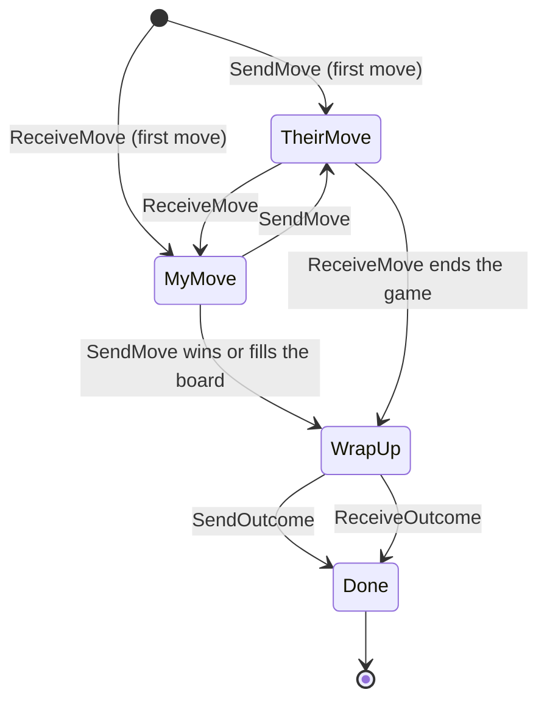
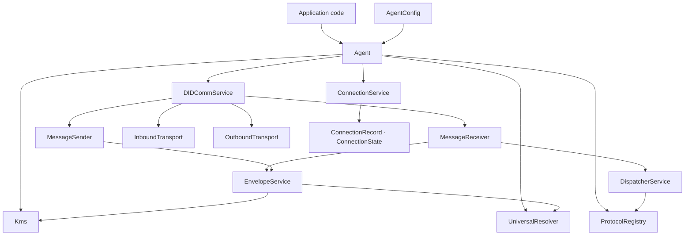
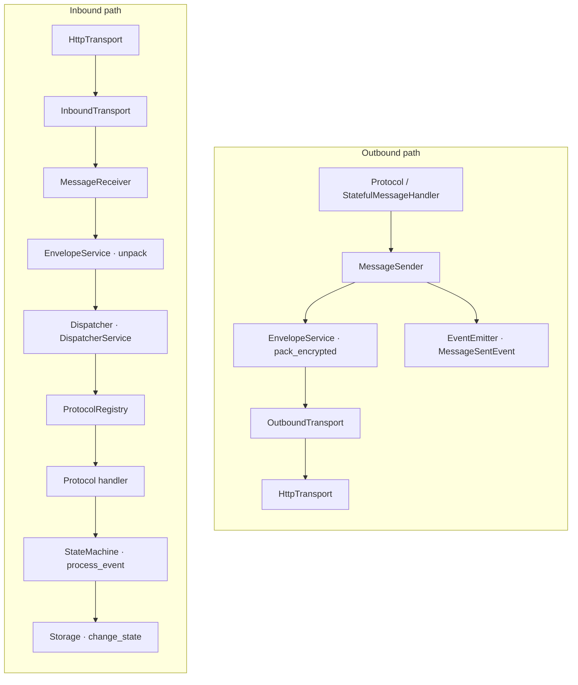
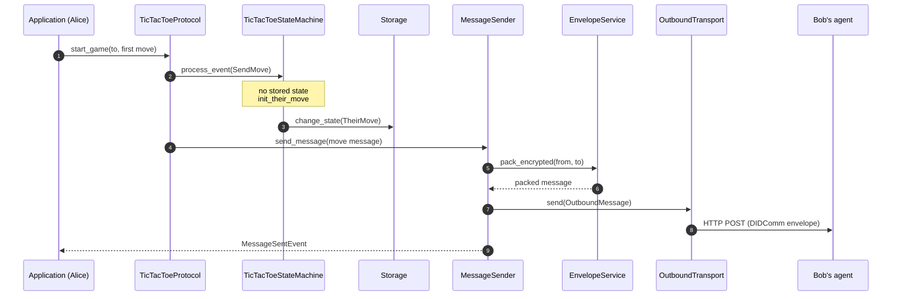
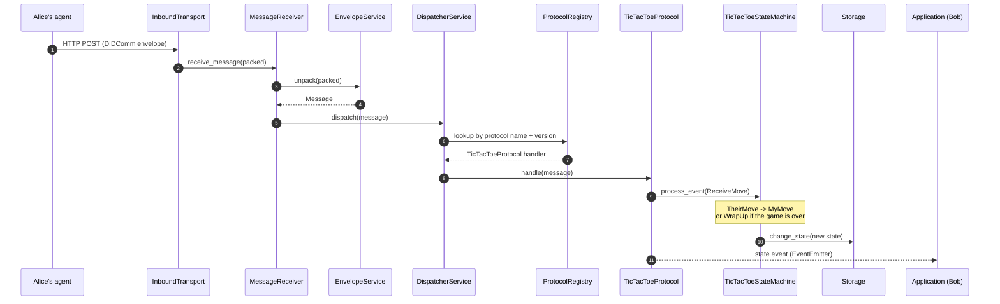
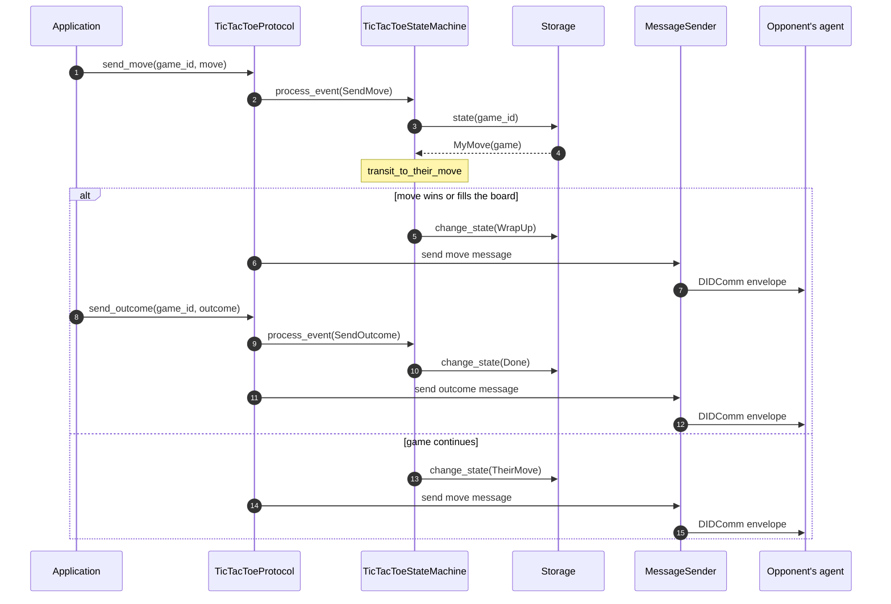

# Required components to enable protocol flows over DIDComm

This document describes the components required for implementing protocols over DIDComm, with
descriptions of the connections between components and their responsibilities.

## API Layer

### Agent (Struct)

- Provides centralized access to protocol service API.
- Exposes the `DIDCommService`, `ConnectionService`, KMS, DID resolver and configuration.
- Enables dependency injection.

### AgentConfig (Struct)

- Contains all configuration parameters for the agent.
- Includes endpoint information and service configurations.

### DIDCommService (Struct)

- Owns the DIDComm message pipeline: `MessageReceiver`, `MessageSender` and the transports, which
  it takes on construction.
- Starts and stops the transports (`initialize`, `shutdown`), tracked by `DIDCommServiceState`.
- Sends outbound messages through the `MessageSender` (`send_message`).

## Core Layer

### MessageReceiver (Struct)

- Handles incoming messages with async methods.
- Coordinates with `EnvelopeService` for unpacking.
- Routes messages to the `Dispatcher`.

### MessageSender (Struct)

- Prepares outbound messages with async methods.
- Coordinates with `EnvelopeService` for packing.
- Sends the packed message over its `OutboundTransport`.
- Emits events for sent messages.

### Dispatcher (Trait)

- Routes messages to appropriate handlers using async methods.
- Manages protocol message flow.

### DispatcherService (Struct)

- Works with `ProtocolRegistry` to find the protocol that handles a message.

### EnvelopeService (Struct)

- Handles message encryption and decryption.

### Protocol (Trait)

- Defines the protocol interface.
- Creates handlers for protocol-specific messages.

### MessageHandler (Trait)

- Handles the protocol messages of the types it declares.

### StatefulMessageHandler (Trait)

- A message handler that provides methods for handling state using an FSM.

### StateMachine (Trait)

- Generic trait for state machines.
- Manages state transitions with type safety.
- Validates transitions.

### ProtocolRegistry (Struct)

- Maintains a registry of supported protocols.
- Thread-safe lookup of protocols.
- Manages protocol versioning.

## Transport Layer

### InboundTransport (Trait)

- Defines the transport interface for listening to incoming messages.

### OutboundTransport (Trait)

- Defines the transport interface for sending outgoing messages.

### HttpTransport (Struct)

- Implements `InboundTransport` and `OutboundTransport` for HTTP.
- Handles HTTP connections using async/await.
- Manages endpoint configuration.

## Connection Layer

### ConnectionService (Trait)

- Centralizes connection management.
- Creates and manages connection records.
- Updates connection states.
- Gets a connection record by id.

### ConnectionRecord (Struct)

- Represents a connection between agents.
- Contains state, DIDs, and metadata.
- Implements serialization/deserialization.
- Contains timestamps for auditing.

### ConnectionState (Enum)

- Enum representing connection states.
- Provides type safety for state transitions.
- Includes the variants `Initial`, `Invited`, `Accepted`, `Abandoned`, `Completed`.

## Example: implementing a custom protocol

`CustomProtocol` (Struct) implements the `Protocol` trait, with handlers implementing either the
`MessageHandler` or the `StatefulMessageHandler` trait.

**`Protocol`**

- Implement the `protocol_name`, `protocol_version` and `get_message_handlers` methods.
- Implement protocol-specific methods.

**`MessageHandler`**

- Implement the `supported_message_types` and `handle` methods to handle protocol-specific
  DIDComm messages.

**`StatefulMessageHandler`**

Handles the messages of a protocol that keeps state between them, driving that state through a
`StateMachine`.

- Define the states and the events as Rust enums.
- Implement `StateMachine`: `state`, `process_event`, `change_state`.
- Implement the handler: `supported_message_types`, `validate_message`, `send_message`,
  `state_machine`, `on_state_transition`.
- Wrap it in `StatefulMessageHandlerWrapper` to register it as a `MessageHandler`.

### Protocol state machine

The Tic Tac Toe reference protocol shows the shape of a `StatefulMessageHandler`. Its states and
transitions ([`fsm/`](../src/didcomm/protocol/tictactoe/fsm)):

## Component interactions

### What `Agent::new` wires together

### Message paths

## Tic Tac Toe protocol flows

### Start game

### Receive your opponent's move

### Move

## See also

- [How to implement a protocol on the Protocol Engine](guidelines/protocol-engine.md)
- Engine source: [`src/didcomm`](../src/didcomm)
- Reference protocol e2e test: [`tests/e2e/protocol_engine.rs`](../tests/e2e/protocol_engine.rs)

