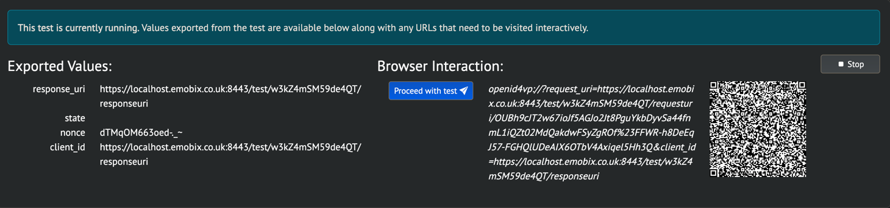

# Conformance testing of Holder (Wallet)

## Testing Holder for Verifiable Presentations

Documentation for VP Holder
is [here](https://openid.net/certification/conformance-testing-for-openid-for-verifiable-presentations/)

### 1) Holder with Redirect Uri (draft 24)

- Test Plan -> OpenID for Verifiable Presentations ID3(plus draft 24): Test a wallet (...)
- Credential Format -> sd_jwt_vc
- Client Id Scheme -> redirect_uri
- Request Method -> request_uri_unsigned (only unsigned for redirect_uri)
- Response Mode -> direct_post

You run demo with cross-device flow and when holder asks for **presentation request uri** from url you insert value of
Browser Interaction's QR code's value:

That is only interaction in this test.

### 2) Holder with did (draft 24)

- Test Plan -> OpenID for Verifiable Presentations ID3(plus draft 24): Test a wallet (...)
- Credential Format -> sd_jwt_vc
- Client Id Scheme -> did
- Request Method -> request_uri_signed (only signed for did)
- Response Mode -> direct_post
- Client_id -> It should be a proper did key and the same as jwks key 'kid'.
  The specification states that if scheme is `did` then scheme is not prefixed to the id. `did:key:1`. 
  Conformance tests may format client id in a wrong format `did:did:key:1`. It you face this situation - cut the unnecessary part.
- Provide a jwks keys where 'kid' must be a did key and the main part(left of '#') should be the same as the client_id

You run demo with cross-device flow and when holder asks for **presentation request uri** from url you insert value of
Browser Interaction's QR code's value:

In some of the cases it is required to upload screenshot of a browser with an error to finish test.